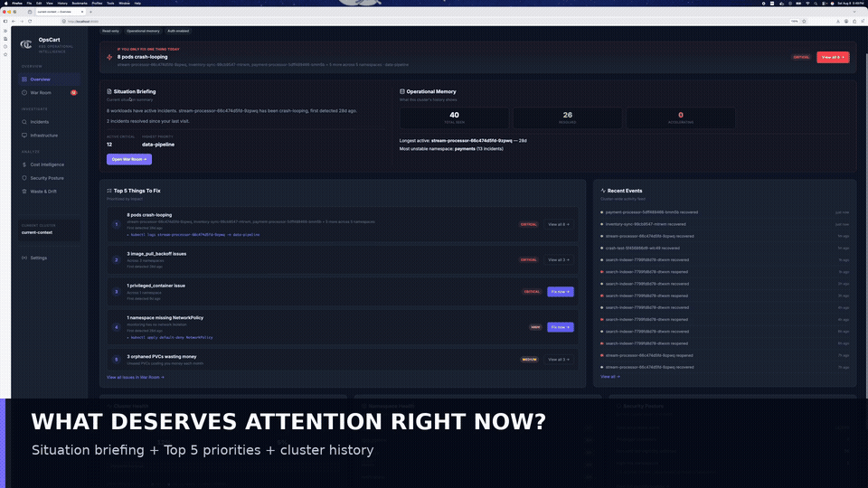
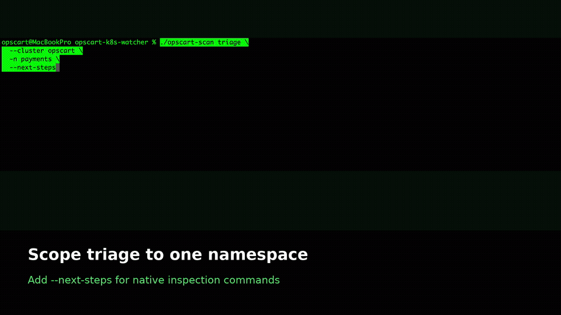
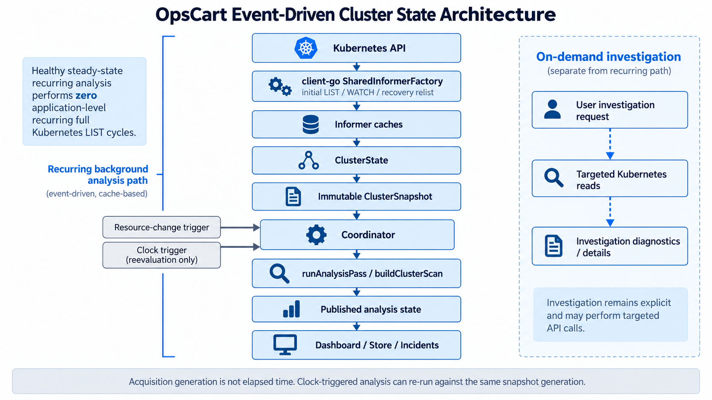

# OpsCart Watcher

**Kubectl shows resources. Lens shows state. OpsCart shows what deserves your attention.**

[](LICENSE)
[](https://github.com/opscart/opscart-k8s-watcher/releases)
[](https://ghcr.io/opscart/opscart-dashboard)
[](https://trivy.dev)

**Read-only** &nbsp;·&nbsp; **No agents** &nbsp;·&nbsp; **Credential-free core** &nbsp;·&nbsp; **Deploy in 30 seconds**

---

## What in this cluster deserves attention right now?

```
kubectl    →  shows resources
Grafana    →  shows metrics
Lens       →  shows cluster state
OpsCart    →  shows what deserves attention first
```

## See OpsCart in action

### Dashboard — prioritized operational intelligence



### CLI — evidence-backed Kubernetes triage



---

[](https://youtube.com/watch?v=BAu-zp48Hh8)
*[Watch the 5-minute demo →](https://www.youtube.com/watch?v=BAu-zp48Hh8)*

---

## How OpsCart works



OpsCart currently has two independent scan paths:

- The CLI performs a one-shot scan whenever `opscart-scan triage` is invoked.
- The dashboard performs scans from its own periodic timer loop.

Each path reads Kubernetes state independently and maintains operational history within its own execution environment. They share parts of the underlying scanner, model, and storage implementation, but some classification and presentation behavior still differs between the two paths. Consequently, the CLI and dashboard may classify or group certain findings differently.

A future design may align more incident semantics through shared canonical classification components. A shared database is not currently required or planned; scan timing and retained history may legitimately differ between the CLI and dashboard.

Both paths use bounded snapshot scans rather than continuous Kubernetes watches. This keeps the core read-only and operationally simple. The tradeoff is that OpsCart provides triage at scan time rather than real-time event alerting.

---

## Why OpsCart?

A healthy dashboard does not always mean a healthy cluster.

Metrics show whether services are meeting their SLOs. OpsCart surfaces operational conditions that can remain hidden or fragmented across dashboards—crash-looping workloads, image pull failures, privileged containers, missing NetworkPolicies, unattached storage, and resource waste.

This is not another alert aggregator. OpsCart preserves operational memory across scans: when an incident was first detected, whether it resolved and later reoccurred, how restart behavior changed, and which workload is currently represents the incident. A replacement pod may be only five minutes old while the workload incident has existed for weeks. OpsCart keeps that workload-level history without presenting the new pod as the identity of the incident.

Instead of requiring operators to correlate several dashboards during triage, OpsCart presents a prioritized view of what deserves attention, the observed evidence behind it, and read-only investigation commands for the next step.

OpsCart is designed for platform engineers managing Kubernetes clusters who want faster operational triage without deploying node agents or modifying application workloads.

---

## Quick Start

### Helm (Recommended)

```bash
helm install opscart-watcher ./helm/opscart-watcher \
  --namespace opscart-system \
  --create-namespace

kubectl port-forward -n opscart-system svc/opscart-watcher 8080:80
open http://localhost:8080
```

Incident history persists on a PVC by default — see the [chart README](helm/opscart-watcher/README.md) for storage options and minikube-specific notes. The raw manifest below is a quickstart; the Helm chart is canonical.
Official container images support both `linux/amd64` and `linux/arm64`.

### kubectl

```bash
kubectl apply -f https://raw.githubusercontent.com/opscart/opscart-k8s-watcher/main/deploy/dashboard.yaml
kubectl port-forward -n opscart-system svc/opscart-watcher 8080:80
open http://localhost:8080
```

### Developer Build

```bash
git clone https://github.com/opscart/opscart-k8s-watcher.git
cd opscart-k8s-watcher
go build -o opscart-dashboard ./cmd/opscart-dashboard
./opscart-dashboard --cluster my-cluster --port 8080
```

---

## First Login

OpsCart requires authentication by default. When `auth.existingSecret` is
empty, Helm creates a release-managed Secret and preserves its generated
credentials across pod restarts and chart upgrades.

```bash
kubectl get secret -n opscart-system opscart-watcher-auth \
  -o jsonpath='{.data.username}' | base64 --decode
echo
kubectl get secret -n opscart-system opscart-watcher-auth \
  -o jsonpath='{.data.password}' | base64 --decode
echo
```

To supply credentials yourself, create a Secret with `username` and `password`
keys and set `auth.existingSecret`:

```bash
kubectl create secret generic opscart-auth \
  --from-literal=username=admin \
  --from-literal=password=<your-password> \
  -n opscart-system
```

```yaml
auth:
  existingSecret: "opscart-auth"
```

Standalone execution without configured credentials still generates and logs a
random password at startup; that password changes when the process restarts.

For team deployments, authenticate at the ingress layer instead with [oauth2-proxy](helm/opscart-watcher/values-oauth2-proxy-example.yaml) — supports Azure AD, Google, GitHub, and generic OIDC. See [Security](docs/05-Security.md) for the full pattern and threat model.

---


## Reproduce OpsCart findings

Want to evaluate OpsCart without breaking workloads manually? The repository includes a self-contained Kubernetes failure lab with intentionally unhealthy and healthy workloads distributed across eight namespaces.

The lab exercises:

* CrashLoopBackOff
* OOMKilled
* Liveness probe failure
* ImagePullBackOff
* Privileged-container detection
* Missing NetworkPolicy coverage
* Unused PersistentVolumeClaims
* Zero-replica Deployments
* Healthy workloads for comparison

> **Warning:** The lab intentionally creates failing workloads, invalid image
> pulls, a privileged container, and unused storage claims. Run it only in a
> disposable or non-production Kubernetes cluster.

```bash
./examples/failure-lab/scripts/setup.sh

# Allow 30–60 seconds for failures and Kubernetes events to develop
opscart-scan triage \
  --cluster "$(kubectl config current-context)" \
  --next-steps

# Remove every lab-owned namespace and workload
./examples/failure-lab/scripts/cleanup.sh
```

See the [OpsCart Kubernetes Failure Lab](examples/failure-lab/README.md) for the complete scenario inventory, setup instructions, validation commands, and cleanup procedure.

## Features

### Overview

The entry point isn't a KPI grid — it's a written assessment. **Situation Briefing** states what's actually wrong in plain sentences ("fraud-detection has been crash-looping for 7 days and its restart rate is accelerating"), not a wall of gauges. Below it:
- **Operational Memory scoreboard** — total incidents ever seen, resolved, reopened, currently accelerating, longest-running incident, most unstable namespace — numbers only possible because OpsCart remembers, not just observes
- **Top 5 Things To Fix** — ranked by severity and restart rate, each with a memory line (first detected, reopen count, trend) and a direct link to investigate
- **Cluster Health, Namespace Health, and Security Status** at a glance

No competitor in this space — Grafana, Lens, k9s — can produce any of this, because none of them remember anything between scans.

### Operational Triage

**Incident Score** — A single 0–100 score derived from crash loops, image pull failures, security posture, waste, and network policy gaps. Trend arrows and a 7-point sparkline show whether the cluster is getting better or worse.

**War Room** — Active workload and node incidents in one prioritized view. Workload findings include crash loops, image pull failures, probe failures, and privileged containers. Kubernetes node conditions are also eligible for ranking: `Ready=False/Unknown` is CRITICAL, while `DiskPressure`, `MemoryPressure`, `PIDPressure`, and `NetworkUnavailable` are HIGH.

Colocated workload count is shown as operational context and does not increase node-condition severity. Each card provides evidence and a read-only investigation path.

**Node Health & Workload Placement** — Detects Kubernetes-reported node conditions including `Ready=False/Unknown`, `DiskPressure`, `MemoryPressure`, `PIDPressure`, and `NetworkUnavailable`. OpsCart correlates workloads currently scheduled to an unhealthy node using Kubernetes node placement, helping distinguish several workload symptoms from a shared infrastructure condition.

Placement correlation is evidence of co-location only — it is **not a
claim of causation**. Unscheduled pods without `spec.nodeName` are not
correlated.

**Investigation** — One click from detection to investigation. Every pod-level incident includes:
- OpsCart Assessment: what the pattern means and estimated investigation time, including whether the restart rate is accelerating
- Incident Timeline: an operational journal — first detected, restart milestones, severity changes, resolved/reoccurred — persisted across pod restarts
- Evidence: severity, first detected, restart count, state, age, owner
- Container Logs: bounded current/previous logs for one selected container at a time, fetched live and never persisted. Enabled by default; set `OPSCART_LOGS_ENABLED=false` or Helm `logs.enabled=false` to disable it.
- Blast Radius: replicas down, sibling pod health, services routing to the workload, ingress exposure, namespace-wide health, and a customer-impact heuristic (internal vs. possible external traffic)
- Recommended Investigation: numbered steps with High / Medium / Low confidence and specific kubectl commands
- Recent Events: last 10 events filtered to this pod
- Related Resources: ConfigMaps, Secrets, PVCs referenced by the pod spec

Namespace-level findings (unprotected namespaces, idle namespaces) get their own dedicated view — a sample NetworkPolicy and namespace-scoped remediation steps, not a pod investigation that doesn't apply.

**Node Investigation** — Node-condition incidents have a dedicated investigation view showing node identity, node pool, Kubernetes-reported condition status/reason/message, workload-placement correlation, and the incident timeline.

When a condition resolves, OpsCart preserves the last retained condition and placement evidence while clearly distinguishing it from the current node state. Node investigations provide read-only commands such as `kubectl describe node` and do not expose application Container Logs.

Node/workload relationships are labeled **correlated by node placement — not a claim of causation**.

**Incidents** — The full system of record: every incident this cluster has seen, active and resolved. Search by name, namespace, or issue type; filter by severity and status; sorted and paginated. Resolved incidents stay visible with recovery time, so you can see what was broken last week — not just what's broken now.

### Operational Insights

**Security Posture** — CIS Kubernetes Benchmark scoring. Failed controls shown first, risk breakdown by category, prioritized remediation actions.

**Waste & Drift** — Zombie pods, orphaned PVCs with storage size and age, zero-replica workloads, abandoned namespaces.

**Cost Intelligence** — Provider-aware worker-node estimates with namespace allocation, embedded Azure pricing, and optional AWS public pricing. See [Cost Intelligence](docs/07-Cost-Intelligence.md).

### Platform

**Operational Memory** — OpsCart remembers what happened. A lightweight local database tracks cluster snapshots, incident lifecycle (detected → milestones → resolved → reopened) as an append-only event journal, and scan metadata. Powers trend arrows, sparklines, incident age, and the per-incident timeline. Backed by SQLite, persisted on a PVC that survives pod restarts and `helm uninstall`. Configurable retention (90 days by default) keeps the database from growing unbounded.

**Authentication** — Basic auth on by default with no disable path: environment variables, a Kubernetes Secret, or an auto-generated password logged at startup. For teams, front it with oauth2-proxy for Azure AD / Google / GitHub / OIDC — see [First Login](#first-login) above.

**Helm Chart** — Full Helm chart with configurable values, PVC-backed persistence, read-only RBAC, and non-root security context. See the [chart README](helm/opscart-watcher/README.md) for persistence options, minikube notes, and all values.

**Agentless** — Runs as a single container. No sidecars, no DaemonSets, and no node access. Core scanning needs no cloud credentials; optional AWS API pricing uses workload identity.

---

## Security

| Property | Detail |
|----------|--------|
| **Base image** | `scratch` — no OS, no shell, no package manager |
| **User** | Non-root (UID 65534) |
| **Binary** | `CGO_ENABLED=0`, statically compiled, `-trimpath` |
| **CVE scan** | 0 vulnerabilities (Trivy) |
| **Cluster permissions** | Read-only ClusterRole (`get`, `list`); includes `get` on `pods/log` by default and removes it when `logs.enabled=false` |
| **Mutations** | None — never modifies cluster state |
| **External calls** | None — no telemetry, no phone-home |
| **Authentication** | Basic auth on by default, no disable path — env var, Secret, or auto-generated password |

```bash
# Audit it yourself
trivy image ghcr.io/opscart/opscart-dashboard:latest
kubectl describe clusterrole opscart-dashboard
```

See [docs/05-Security.md](docs/05-Security.md) for the full threat model and security philosophy.

---

## How It Compares

| Tool | Primary Question |
|------|-----------------|
| **kubectl** | What resources exist? |
| **Lens / k9s** | What is running right now? |
| **Grafana** | Are metrics within thresholds? |
| **Kubecost** | Where is money being spent? |
| **OpsCart** | What deserves attention first? |

OpsCart is not a replacement for these tools. It is the triage layer that tells you which questions to ask of your observability stack.

---

## Helm Configuration

See [helm/opscart-watcher/README.md](helm/opscart-watcher/README.md)
for the full values reference, persistence configuration, and
environment-specific notes (minikube, multi-node, local images).

---

## CLI Reference

```bash
go build -o opscart-scan ./cmd/opscart-scan

./opscart-scan triage --cluster prod                    # Prioritized operational triage from the terminal
./opscart-scan triage --cluster prod --next-steps       # Include read-only kubectl inspection commands
./opscart-scan triage --cluster prod -n payments        # Limit triage to one namespace
./opscart-scan security --cluster prod                  # Workload security posture
./opscart-scan waste --cluster prod                     # Waste and drift review
./opscart-scan cloud-costs --cluster prod               # Provider-aware cost analysis
./opscart-scan network --cluster prod                   # NetworkPolicy gaps
./opscart-scan report --cluster prod                    # Generate an HTML report
```
Emergency triage also surfaces active Kubernetes node conditions with derived severity, Kubernetes-reported reason, compact workload/pod placement counts, and read-only `kubectl describe node` guidance. Healthy nodes do not add noise to the CLI output.

Generated next steps are inspection commands only. OpsCart does not automatically apply, patch, delete, restart, scale, or otherwise modify workloads.
---

## Coming Next

- Related incidents (cross-incident correlation — same namespace, shared config/secrets, correlated timing)
- Root cause confidence scoring (deterministic, evidence-based)
- Native OIDC authentication + namespace-scoped authorization (SubjectAccessReview-based)
- Slack and Teams notifications
---

## Disclaimer

Awareness tool — not for formal compliance auditing. Use [kube-bench](https://github.com/aquasecurity/kube-bench) for official CIS compliance. Cost figures are public-pricing estimates, not invoices; see [Cost Intelligence](docs/07-Cost-Intelligence.md).

---

**Author:** Shamsher Khan — [opscart.com](https://opscart.com) · [IEEE Senior Member](https://ieee.org) · [DZone Core Member](https://dzone.com/users/shamsher_khan)

[](https://github.com/opscart/opscart-k8s-watcher/releases)

**License:** MIT

## Contact

Questions, feedback, or security concerns: [info@opscart.com](mailto:info@opscart.com)
