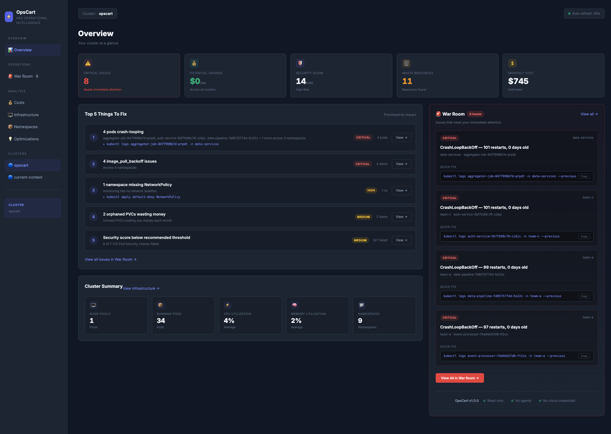

# OpsCart Kubernetes Watcher

**Kubectl shows resources. Lens shows state. OpsCart shows what deserves your attention.**

[](https://github.com/opscart/opscart-k8s-watcher/releases)
[](https://go.dev)
[](LICENSE)
[](https://ghcr.io/opscart/opscart-dashboard)
[](https://trivy.dev)

✅ **Read-only** &nbsp;·&nbsp; ✅ **No agents** &nbsp;·&nbsp; ✅ **No cloud credentials** &nbsp;·&nbsp; ✅ **Deploy in 30 seconds**

- ① Critical Issues
- ② Top 5 Things To Fix
- ③ War Room
- ④ Cost Analysis



---

## What is broken? What is wasting money? What should I fix first?

OpsCart continuously analyzes your Kubernetes clusters and surfaces the operational risks that deserve attention — without touching production.

Most Kubernetes tools show cluster state.

OpsCart continuously analyzes operational risk across cost, security, waste, and reliability, then prioritizes what deserves attention first.

### Why OpsCart?
```
Lens shows resources.
Grafana shows metrics.
kubectl shows objects.
OpsCart shows what deserves attention.
```

OpsCart is the operational intelligence layer between `kubectl` and full observability platforms. It aggregates risk across operations, cost, security, and waste — then prioritizes what to fix first.

---
**Used on real clusters with:**

- 200+ running pods
- 25+ namespaces
- Multi-node pools
- Enterprise RBAC environments

---

## The War Room

The flagship feature. One screen showing every critical incident in your cluster:

- 🔴 **CrashLoopBackOff pods** — with restart counts and age
- 🟠 **ImagePullBackOff failures** — with `kubectl describe` ready to copy
- 🔴 **OOMKilled containers** — out-of-memory incidents
- 🟡 **Unprotected namespaces** — no NetworkPolicy defined
- 🟡 **Orphaned PVCs** — storage charging with no consuming pod

Each issue includes severity, namespace, age, and a `kubectl` command to investigate.

---

## 🚀 Deploy in 30 Seconds

### In-Cluster (Recommended)

```bash
kubectl apply -f https://raw.githubusercontent.com/opscart/opscart-k8s-watcher/main/deploy/dashboard.yaml
kubectl port-forward -n opscart-system svc/opscart-dashboard 8080:80
open http://localhost:8080
```

Runs as a Deployment with read-only ClusterRole. Removable in one command: `kubectl delete -f deploy/dashboard.yaml`.

### Local Binary

```bash
git clone https://github.com/opscart/opscart-k8s-watcher.git
cd opscart-k8s-watcher
go build -o opscart-dashboard ./cmd/opscart-dashboard
./opscart-dashboard --cluster my-cluster --port 8080
```

### Docker

```bash
docker run -p 8080:8080 \
  -v ~/.kube:/root/.kube \
  ghcr.io/opscart/opscart-dashboard:v1.0.0
```

### CLI for Terminal Workflows

```bash
go build -o opscart-scan ./cmd/opscart-scan

./opscart-scan emergency --cluster prod      # War Room from terminal
./opscart-scan security --cluster prod       # CIS scoring
./opscart-scan waste --cluster prod          # Find idle resources
./opscart-scan cloud-costs --cluster prod    # Azure cost analysis
```

---

## 🛡️ Built for Security-Sensitive Environments

OpsCart is designed to deploy in production without raising eyebrows from your platform team.

| Property | Detail |
|----------|--------|
| **Base image** | `scratch` — no OS, no shell, no package manager |
| **Image size** | ~50 MB |
| **User** | Non-root (UID 65534) |
| **Binary** | Statically compiled, `CGO_ENABLED=0`, `-trimpath` |
| **CVE scan** | 0 vulnerabilities (Trivy) |
| **Cluster permissions** | Read-only ClusterRole (`get`, `list` only) |
| **Pod exec access** | None |
| **Secret access** | None |
| **External calls** | None (no telemetry, no phone-home) |
| **Cloud API calls** | None (Azure pricing embedded at build time) |

**Audit it yourself:**

```bash
trivy image ghcr.io/opscart/opscart-dashboard:v1.0.0
kubectl describe clusterrole opscart-dashboard
docker history ghcr.io/opscart/opscart-dashboard:v1.0.0
```

---

## 🧠 What OpsCart Detects

### Operational Risk (War Room)

Every issue that needs human attention, grouped by type and prioritized:

- CrashLoopBackOff, OOMKilled, ImagePullBackOff pods
- Unprotected namespaces (missing NetworkPolicy)
- Orphaned PVCs (storage with no consuming pod)
- Zero-replica deployments
- Stale jobs and batch workloads

### Cost Intelligence

Reads Kubernetes node labels, looks up Azure retail pricing, allocates costs to namespaces proportionally.

- 40+ VM SKUs (B/D/E/F/L series), Spot and On-Demand
- Reserved Instance savings (1yr/3yr)
- Per-deployment cost breakdown
- 15+ Azure region multipliers

**No Azure credentials needed.** Pricing is embedded in the binary.

### Security Posture

CIS Kubernetes Benchmark v1.8 scoring with environment-aware analysis. Separates **actionable issues** from **expected infrastructure** configs (CNI, CSI, monitoring).

### Waste Detection

9 resource types analyzed, suggestions only — **never modifies the cluster**.

---

## 🆚 vs. Other Tools

| Tool | Shows | OpsCart's Difference |
|------|-------|---------------------|
| **kubectl** | Resources | OpsCart prioritizes |
| **Lens** | Cluster state | OpsCart aggregates risk |
| **k9s** | Real-time pods | OpsCart explains impact |
| **Datadog / New Relic** | Metrics + logs | OpsCart needs no agents |
| **Kubecost** | Detailed cost only | OpsCart correlates cost + risk |

OpsCart isn't a replacement for these tools — it's the operational triage layer that tells you what to look at first.

---

## 📋 CLI Reference

| Command | Description |
|---------|-------------|
| `emergency` | War Room — what's broken right now |
| `security` | CIS Benchmark security posture |
| `waste` | Orphaned, idle, and zombie resources |
| `cloud-costs` | Real-time Azure cost analysis |
| `network` | Network policy gap analysis |
| `costs` | Resource-share cost allocation |
| `report` | Comprehensive cluster health HTML report |
| `resources` | Cluster resource inventory |

**Common flags:**

```bash
--cluster CLUSTER         # Target cluster context
--all-clusters            # Scan all configured clusters
--format html|json|table  # Output format
--namespace NS            # Scope to single namespace
```

---

## 🗺️ Roadmap

**v1.0** ✅ — Operational intelligence dashboard
- Top 5 Things to Fix
- War Room featured panel
- Critical Issues as primary KPI
- Sidebar: Overview → Operations → Analysis
- Trust-first architecture

**v1.1** — Triage depth
- Issue grouping with expand/collapse
- War Room drill-downs (filter by namespace, severity, type)
- Recommended actions with one-click investigation
- Lucide icons replacing emojis

**v1.2** — Historical intelligence
- SQLite-backed history (Critical Issues over time, cost trends)
- 7/30/90 day comparison views
- "Cost increased 18% this week" trend signals
- Slack/Teams alerts for new critical issues

**v2.0** — Multi-cloud + ecosystem
- AWS and GCP cost analysis
- Helm chart distribution
- Prometheus integration (optional)
- Multi-tenancy and RBAC for dashboard users

---

## 📅 Version History

| Version | Date | Highlights |
|---------|------|------------|
| **v1.0.0** | Jun 2026 | **Operational intelligence dashboard** — Top 5 Things to Fix, War Room featured panel, trust-first positioning, complete refactor |
| v0.9.0 | Jun 2026 | Full dashboard with 5 tabs |
| v0.8.0 | Jun 2026 | Live in-cluster FinOps dashboard |
| v0.7.0 | Jun 2026 | `cloud-costs` command with embedded Azure pricing |
| v0.6.0 | May 2026 | Resource-share cost allocation |
| v0.5.x | Feb 2026 | Waste detection (9 types), HTML reports |
| v0.4.0 | Feb 2026 | Network policy gap analysis |
| v0.3.0 | Feb 2026 | HTML report generation, CIS scoring |
| v0.2.0 | Feb 2026 | Multi-cluster support |
| v0.1.0 | Jan 2026 | Initial release |

---

## ⚠️ Disclaimer

Security awareness tool — **not for formal compliance auditing**. Use [kube-bench](https://github.com/aquasecurity/kube-bench) for official CIS compliance. Cost estimates are based on Azure public retail pricing — actual costs vary with EA/MACC agreements.

---

## 🤝 Contributing

Issues, PRs, and feature requests welcome. Built for the Kubernetes community.

**Author:** Shamsher Khan — [IEEE Senior Member](https://ieee.org) · [opscart.com](https://opscart.com) · [DZone Core Member](https://dzone.com/users/shamsher_khan)

---

**License:** MIT